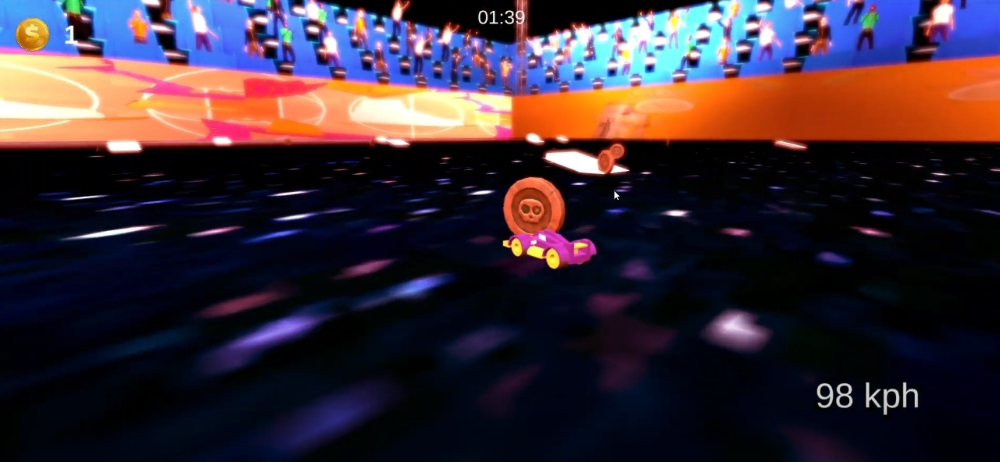

# Retro Rush

## 🚀 Overview
Retro Rush is a high-speed, synthwave-inspired arcade racing game where players navigate a neon-lit cyberpunk city, dodging traffic, outrunning AI-powered police, and experiencing the nostalgia of classic 90s racing games.

## 🎮 Features
- **High-Speed Arcade Racing** - Experience thrilling and responsive driving mechanics with a retro aesthetic.
- **AI-Enhanced Police Pursuit** - Intelligent police units that adapt and chase players dynamically.
- **Synthwave Visuals & Soundtrack** - Immerse yourself in a stunning neon-lit environment with a nostalgic soundtrack.

## 🛠️ Technology & Architecture
- **Game Engine**: Unity
- **Programming Language**: C#
- **Development Focus**: Optimized physics, AI behavior, and immersive visuals.

## 🔑 Core Algorithms
- **AI Pursuit System**: Uses Unity’s NavMesh for pathfinding and custom AI behaviors to chase the player.
- **Drift & Speed Mechanics**: A custom physics system that enhances drifting and acceleration.
- **Dynamic Traffic System**: Randomized car spawning with obstacle avoidance.

## 📖 Installation & Setup
1. Clone the repository:
   ```sh
   git clone https://github.com/abuegila/retro-rush.git
   ```
2. Open the project in Unity (Recommended version: Unity 2021+).
3. Press **Play** in the Unity editor or build for your preferred platform.

## 🎥 Demo
[![Logo]](Assets/D1.webp)
[](https://youtu.be/iXqts__eX60)

## 🖼️ Screenshots





## 🌍 Landing Page
Check out the official **Retro Rush** landing page for more details and updates:
[Retro Rush Landing Page](https://yusufabuegila.wixsite.com/retrorush)

## 🏆 Challenges Overcome
- **AI Optimization**: Efficient police pursuit without performance issues.
- **Smooth Drift Mechanics**: Achieving arcade-like handling.
- **Synthwave Aesthetics**: Balancing vibrant visuals with performance constraints.

## 📚 Learnings
- Advanced AI behavior modeling.
- Optimizing physics interactions in Unity.
- Enhancing game feel through audio and visuals.

## 📝 License
This project is based on [Arcade Racing Game Unity](https://github.com/striderzz/Arcade-Racing-Game-Unity) by **striderzz**, which is licensed under the MIT License.

Retro Rush is also licensed under the MIT License. See the [LICENSE](LICENSE) file for details.

---

© 2025 Retro Rush. All rights reserved.
